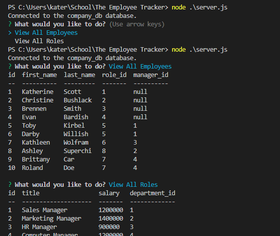

## Name
The Employee Tracker

## Description
Use this employee tracker to view current employees, departments, and roles; as well as add new employees, departments, and roles. This application uses SQL, JavaScript, Inquire, and Node to present and edit the data.

## Visuals
This picture shows the server! 

## Contributing
Collaborated with Johnny McGrown

## Languages Used
Languages: JavaScript and SQL
Applications: Inquire, ExpressJS, and Node
